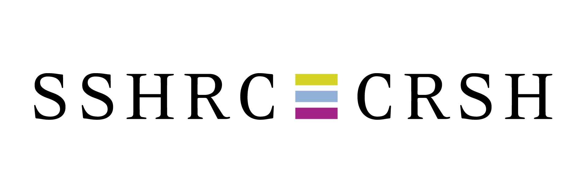
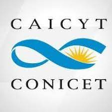

*  [The Social Science and Humanities Research Council (Canada)](https://www.sshrc-crsh.gc.ca/)
*  [The Alfred P. Sloan Foundation](https://sloan.org/)
*  [FORCE11](https://force11.org)
*  [Consejo Latinoamericano de Ciencias Sociales (CLACSO)](https://www.clacso.org)
*  [Centro Argentino de Información Científica y Tecnológica (CAICYT-CONICET)](https://www.conicet.gov.ar/caicyt/)

