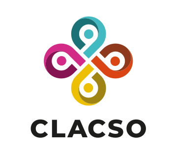
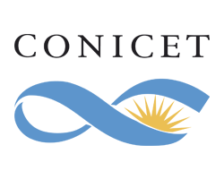
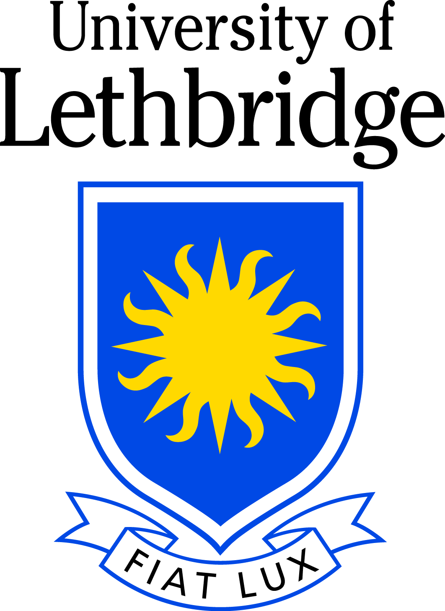
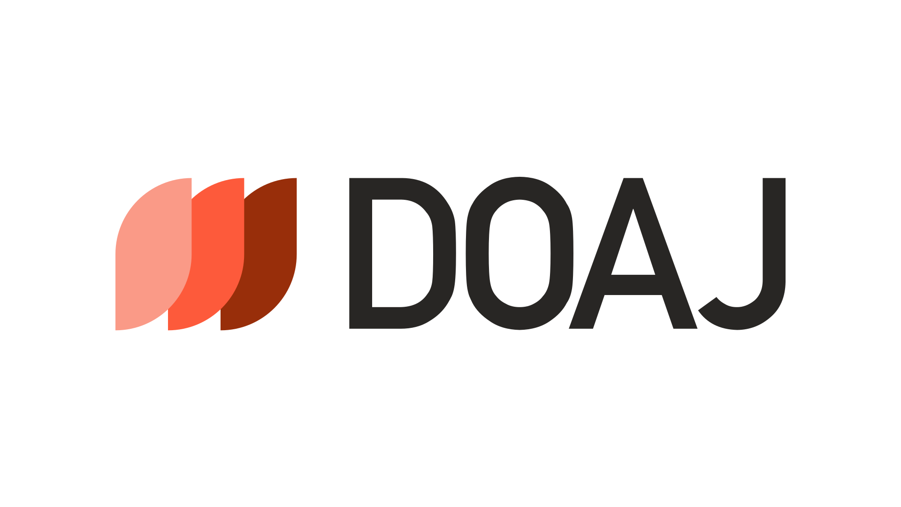

[{:width="200px";padding="100px"}](https://www.sshrc-crsh.gc.ca/)  
**Social Science and Humanities Research Council (Canada)**

[{:width="200px";padding="100px"}](https://sloan.org/)  
  
**The Alfred P. Sloan Foundation** (The REPO project)

[{:width="200px";padding="100px"}](https://force11.org)  
  
**FORCE11**

[{:width="100px";padding="100px"}](https://www.clacso.org)  
**Consejo Latinoamericano de Ciencias Sociales (CLACSO)**

[{:width="100px";padding="100px"}](https://www.conicet.gov.ar/caicyt/)  
**Centro Argentino de Información Científica y Tecnológica (CAICYT-CONICET)**

[{:width="100px";padding="100px"}](http://uleth.ca)  
  
**The University of Lethbridge**

[{:width="100px";padding="100px"}](https://doaj.org/)

**Directory of Open Access Journals (DOAJ)**